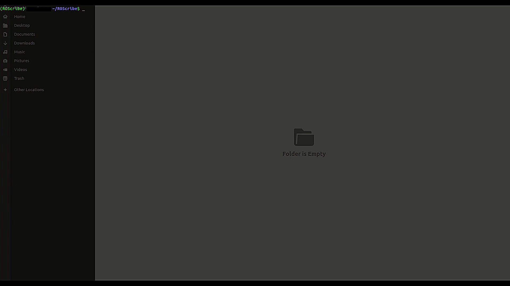
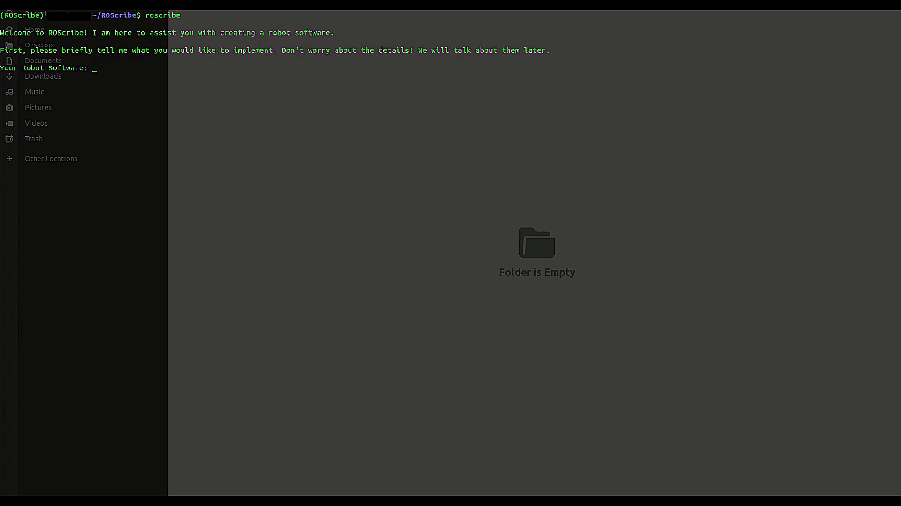
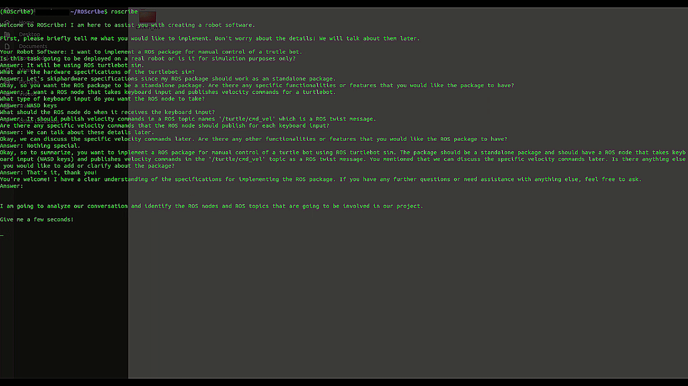
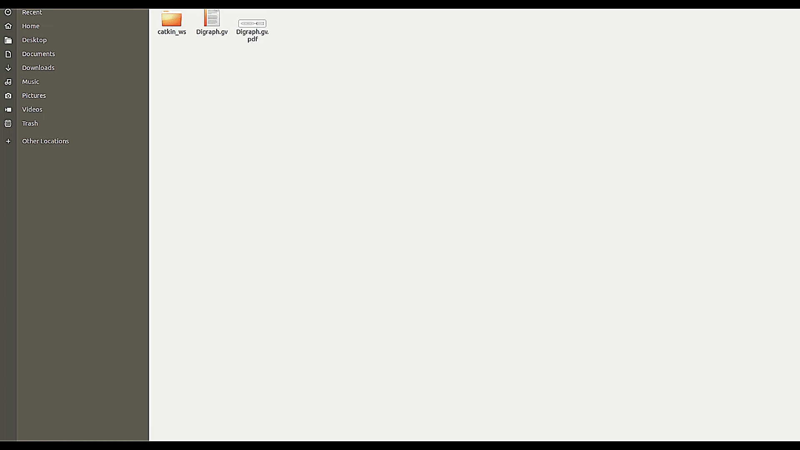

# ROScribe

**Create ROS packages using LLMs.**

Using a natural language interface to describe robotic projects, ROScribe eliminates the skill barrier of using ROS for beginners, and saves time and hassle for skilled engineers. ROScribe combines the sheer power and flexibility of large language models (LLMs) with prompt tuning techniques to capture the details of your robotic design and to automatically create an entire ROS package for your project.

Inspired by [GPT Synthesizer](https://github.com/RoboCoachTechnologies/GPT-Synthesizer), ROScribe builds an entire ROS package through a series of specification steps that identify the package elements in a top-down approach. In particular, ROScribe helps you with the following steps:

1. Creating a list of ROS nodes and topics, based on your application and deployment (e.g. simulation vs. real-world)
2. Visualizing your project in an RQT-style graph
3. Generating code for each ROS node
4. Writing launch file and installation scripts

If you are new to ROS, ROScribe will be your robot(ics) mentor 🤖️

If you are a seasoned ROS user, ROScribe can help with creating a blueprint for your ROS package 📦️

## Installation

- `pip install roscribe`

- For development:
  - `git clone https://github.com/RoboCoachTechnologies/ROScribe.git`
  - `cd ROScribe`
  - `pip install -e .`

## Usage

ROScribe uses OpenAI's `gpt-3.5-turbo-16k` as the default LLM. You can switch to other [supported models](https://python.langchain.com/docs/integrations/llms/) by LangChain; however you might have to get the API for each model or [run them locally](https://python.langchain.com/docs/integrations/llms/huggingface_pipelines).

- Setup your OpenAI API key: `export OPENAI_API_KEY=[your api key]`

**Run**:

- Start ROScribe by typing `roscribe` in the terminal.

- Briefly describe the robot software you want to deploy.

- ROScibe asks you high-level questions regarding your deployment.

- Once ROScribe learns about your project, it shows you a list of ROS nodes and topics that are involved in your software. The subscriber/publisher relationship between the ROS nodes can be visualized similar to RQT graph.

- Moreover, you can edit (i.e. add/remove) the list of ROS nodes and topics based on your preference.

- After you finalize the node list, ROScribe will start identifying the specifications of each ROS node through a Q&A process. This is the most important step since the final implementation would be highly influenced by this conversation.

- The code for each node is generated when ROScribe finds all the implementation details. Additionally, ROS launch file and installation scripts (package.xml and CMakeLists.txt) are created according to the project requirements. For Python ROS nodes, don't forget to allow executing your nodes as programs via `chmod +x ros_node.py`.

- After ROScribe finishes code generation, you can install your ROS package by using `catkin`. After installation, source your workspace in order to link to your ROS packages.

- You can launch your ROS package by using `roslaunch` command and calling the generated launch file.

## Roadmap

Currently, ROScribe only supports ROS1 with Python code generation. We aim to add the following features in the coming releases:
- ROS2 support
- C++ code generation
- ROS1 to ROS2 automated codebase migration

As an open-source project, we encourage all robotics enthusiasts to contribute to ROScribe. During each release, we will announce the list of new contributors.

## Contact

For business inquiries, such as consulting or contracting jobs, please contact robocoachtechnologies@gmail.com. 

